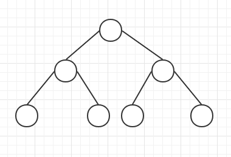

# react-mini-algorithm
JS实现最小堆和偏排序算法

### 目标：

1. 掌握最小堆
2. 掌握偏排序

了解最小堆之前，我们先要了解以下概念：

### 二叉树

是指树中节点的度不大于2的有序树，它是一种最简单且最重要的树。

### 满二叉树

除最后一层无任何子节点外，每一层的所有结点都有两个子结点的二叉树。

从图形形态上看，满二叉树外观上是一个三角形。

如果一个二叉树的层数为K，且结点总数是(2^k)-1，则它就是满二叉树。

 

### 完全二叉树

一棵深度为K的有n个结点的二叉树，对树中的结点按从上至下，从左到右的顺序进行编号，如果编号为i(1sisn)的结点与满二叉树中编号为i的结点在二叉树中的位置相同，则这棵二叉树称为完全二叉树。

叶子结点只可能在最大的两层出现。

 

如果上面的11的节点不存在，那么整棵树就不是完全二叉树了，可以从右边缺，但不能从左边缺。所以即便12没有了，也还是一棵完全二叉树。

### 最小堆

最小堆，是一种经过排序的完全二叉树，其中任一非终端节点的数据值均不大于其左子节点和右子节点的值

 

| 数组     | 3    | 7    | 4    | 10   | 12   | 9    | 6    | 15   | 14   |
| -------- | ---- | ---- | ---- | ---- | ---- | ---- | ---- | ---- | ---- |
| 深度     | 1    | 2    | 2    | 3    | 3    | 3    | 3    | 4    | 4    |
| 数组下标 | 0    | 1    | 2    | 3    | 4    | 5    | 6    | 7    | 8    |

根据父节点下标推算子节点下标：

leftIndex = (parentIndex + 1) * 2 - 1

rightIndex = leftIndex + 1

根据子节点下标推算父节点下标：

parentIndex = (childIndex - 1) >>> 1

节点操作：

1. 获取最小节点 heap[0]
2. 插入元素
3. 删除元素

插入元素5

1. 因为5 < 12，则5与12交换位置，5从底部向上调整
2. 5 < 7，5与7交换位置，继续往上调整
3. 5 > 3，停止调整

删除元素

1. 先取heap[0]
2. 为了不破坏数据结构，可以执行数组的pop，把尾元素14放到heap[0]，但是这个时候已经不是最小堆了，需要往下调整
3. 从0位置节点开始往下调整，与左右节点比较，找出最小，如先与4交换
4. 再与6交换
5. 完成

