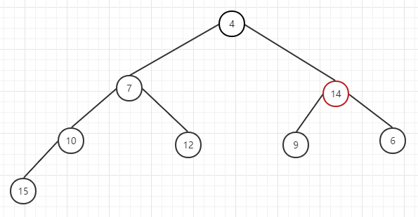

# react-mini-algorithm
JS实现最小堆和偏排序算法

### 目标：

1. 掌握最小堆
2. 掌握偏排序


### 找出第K大的数字

[4，5，8，2 ...]

这个时候，你可能很容想到用数组的sort方法排序来解决

```javascript
const sortArr = arr.sort((a, b) => b - a )
```

那么第K大的数字就是`sortArr[k-1]`

但如果有1000万个乱序的数字呢，很明显当数据量很大的时候再采取这种全排序的方法则不合适了。

举个例子，我想在北京找一家最好吃的早餐店，但北京可能有10万个早餐店，甚至1000万个，假如北京有10万个早餐店，我就想要第二大好吃的，我不要第一大，我就要第二大，排名排到第二的，那么怎么找呢？肯定不可能像上面那样从1到10万这样全排序，那得多耗时间啊！

这个时候，相对全排序，有一个叫偏排序的方法，则非常合适，那么什么叫偏排序呢？

找出这些数字里前K名的大数字，后面的小数字则不要了，也就是说只要给前K名的数字做个排序的就可以了，但也不用全排序，就算前K名的数字也不用全排序，只要这个前K名最小的就可以了，也就是只要将这前K名的数字做个最小堆的数据结构，拿出最小的数字就可以了


了解最小堆之前，我们先要了解以下概念：

### 二叉树

是指树中节点的度不大于2的有序树，它是一种最简单且最重要的树。

### 满二叉树

除最后一层无任何子节点外，每一层的所有结点都有两个子结点的二叉树。

从图形形态上看，满二叉树外观上是一个三角形。

如果一个二叉树的层数为K，且结点总数是(2^k)-1，则它就是满二叉树。

 


### 完全二叉树

一棵深度为K的有n个结点的二叉树，对树中的结点按从上至下，从左到右的顺序进行编号，如果编号为i(1sisn)的结点与满二叉树中编号为i的结点在二叉树中的位置相同，则这棵二叉树称为完全二叉树。

叶子结点只可能在最大的两层出现。

 

如果上面的11的节点不存在，那么整棵树就不是完全二叉树了，可以从右边缺，但不能从左边缺。所以即便12没有了，也还是一棵完全二叉树。

接下来，我们说下一个概念：

### 最小堆

最小堆，是一种经过排序的完全二叉树，其中任一非终端节点的数据值均不大于其左子节点和右子节点的值

 

每一个子树都满足根节点最小，没有14也是最小堆，但没有15，14还在则不是最小堆了，因为它已经不是一棵完全二叉树了。


### 最小堆的数据结构

在JS中我们可以选择数组来作为最小堆的数据结构


| 数组     | 3    | 7    | 4    | 10   | 12   | 9    | 6    | 15   | 14   |
| -------- | ---- | ---- | ---- | ---- | ---- | ---- | ---- | ---- | ---- |
| 深度     | 1    | 2    | 2    | 3    | 3    | 3    | 3    | 4    | 4    |
| 数组下标 | 0    | 1    | 2    | 3    | 4    | 5    | 6    | 7    | 8    |


#### 根据父节点下标推算子节点下标：

leftIndex = (parentIndex + 1) * 2 - 1

rightIndex = leftIndex + 1


#### 根据子节点下标推算父节点下标：

parentIndex = (childIndex - 1) >>> 1


#### 

### 实现一个最小堆

```javascript
class MinHeap {
    constructor(data = []) {
        // 最小堆
        this.data = data
    }
    // 计算长度
    size() {
        return this.data.length
    }
}
```

#### 节点操作：

##### 获取最小节点 heap[0]

假如this.data已经是最小堆了的话，那么this.data[0]就是最小堆的值

```javascript
// 获取最小堆的值
peek() {
	return this.size() === 0 ? null : this.data[0]
}
```

##### 插入元素

插入元素5

要确保原先的数据结构不变，可以从尾部插入元素

 


- 因为5 < 12，则5与12交换位置，5从底部向上调整

 


- 5 < 7，5与7交换位置，继续往上调整

 


- 5 > 3，停止调整

 


###### 往最小堆里添加元素

```javascript
// 往最小堆里添加元素
push(node) {
    this.data.push(node)
    // 调整位置
    this.siftUp(node, this.size() - 1)
}
```

###### 调整位置

```javascript
// 往最小堆里添加元素
push(node) {
    this.data.push(node)
    // 调整位置
    this.siftUp(node, this.size() - 1)
}

siftUp(node, i) {
    let index = i
    while(index > 0) {
        // 父节点下标
        const parentIndex = (index -1) >>> 1 // 位运算相当于 除以2
        // 父节点
        const parent = this.data[parentIndex]
        // 是否需要进行相应的位置调整
        if(this.compare(node, parent) < 0) {
            // 子节点 < 父节点
            this.swap(index, parentIndex)
            // 调整之后的节点下标
            index = parentIndex
        } else {
            break
        }
    }
}
```

其实就是index不断变化的过程，调整到最后的时候index最小只能是0。根据上面的公式我们可以找出父节点的下标和父节点然后和当前节点进行对比，看是否需要进行相应的位置调整

###### 比较两个元素

```javascript
// 比较
compare(a, b) {
    return a - b
}
```

如果compare的结果小于0，则说明a小于b。另外将比较的过程单独抽离成一个函数可以方便以后进行修改，比如将来a和b不是两个数字了，而是两个对象，则可以很方便进行修改`a.sort`-`b.sort`

###### 交换元素

```javascript
// 交换两个变量的值
swap(index1, index2) {
    // [a, b] = [b, a]
    [this.data[index1], this.data[index2]] = [
        this.data[index2],
        this.data[index1]
    ]
}
```


##### 删除元素

- 先取heap[0]

 


- 为了不破坏数据结构，可以执行数组的pop，把尾元素14放到heap[0]，但是这个时候已经不是最小堆了，需要往下调整

 


- 从0位置节点开始往下调整，与左右节点比较，找出最小，如先与4交换

 


- 再与6交换

 


- 完成

 

###### 删除最小堆的最小值 

```javascript
// 删除最小堆的最小值
pop() {
    if(this.size() === 0) {
        return null
    }

    const first = this.data[0]
    const last = this.data.pop()
    // if(first !== last) {
    if(this.size() !== 0) {
        this.data[0] = last
        // 向下调整
        this.siftDown(last, 0)
    }
}

siftDown(node, i) {
    let index = i
    const length = this.size()
    const halfLength = length >>> 1
    while(index < halfLength) {
        const leftIndex = (index + 1) * 2 - 1
        const rightIndex = leftIndex + 1
        const left = this.data[leftIndex]
        const right = this.data[rightIndex]
        if(this.compare(left, node) < 0) {
            // left < 父节点
            if( rightIndex < length && this.compare(right, left) < 0) {
                // right < left ，right 最小
                this.swap(rightIndex, index)
                index = rightIndex
            } else {
                // right >= left，left最小
                this.swap(leftIndex, index)
                index = leftIndex
            }
        } else if(rightIndex < length && this.compare(right, node) < 0) {
            // left > node, right < node
            // right 最小
            this.swap(rightIndex, index)
            index = rightIndex 
        } else {
            // 根节点最小
            break
        }
    }
}
```

### 实现一道力扣题

#### [703. 数据流中的第 K 大元素](https://leetcode-cn.com/problems/kth-largest-element-in-a-stream/)

设计一个找到数据流中第 k 大元素的类（class）。注意是排序后的第 k 大元素，不是第 k 个不同的元素。

请实现 KthLargest 类：

KthLargest(int k, int[] nums) 使用整数 k 和整数流 nums 初始化对象。
int add(int val) 将 val 插入数据流 nums 后，返回当前数据流中第 k 大的元素。

**示例：** 

```
输入：
["KthLargest", "add", "add", "add", "add", "add"]
[[3, [4, 5, 8, 2]], [3], [5], [10], [9], [4]]
输出：
[null, 4, 5, 5, 8, 8]

解释：
KthLargest kthLargest = new KthLargest(3, [4, 5, 8, 2]);
kthLargest.add(3);   // return 4
kthLargest.add(5);   // return 5
kthLargest.add(10);  // return 5
kthLargest.add(9);   // return 8
kthLargest.add(4);   // return 8
```


